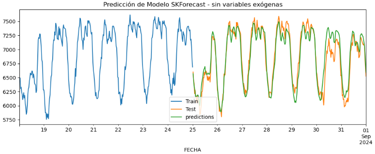
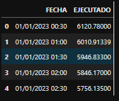
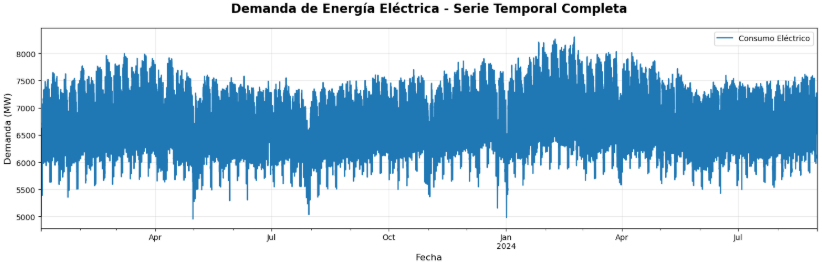
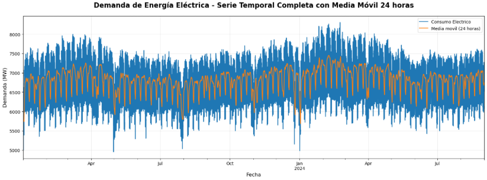
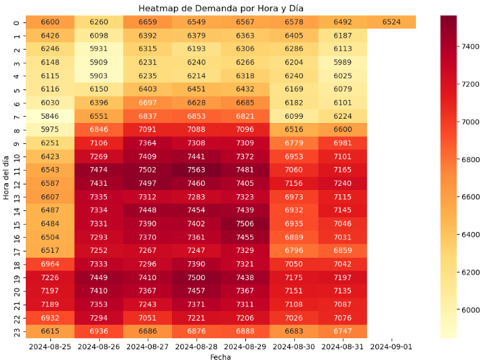
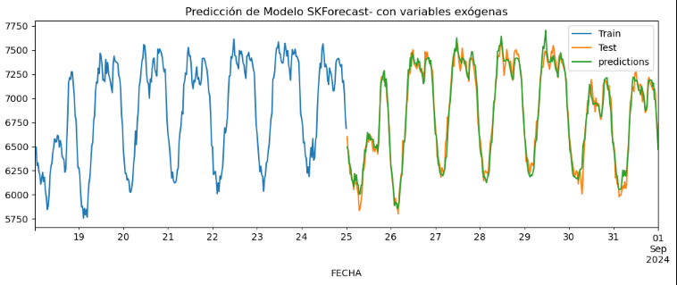

# Proyecto de Predicción de Consumo de Energía Eléctrica con SKForecast

<div align="center">
  
  
  
</div>

## 📊 Descripción del Proyecto

Este proyecto desarrolla un modelo de Machine Learning para pronosticar el consumo de energía eléctrica con un horizonte de predicción de una semana, utilizando la librería SKForecast y técnicas avanzadas de ingeniería de características.



*Imagen 1: Configuración inicial del proyecto y librerías utilizadas*

## 🎯 Objetivos

- 🔮 Predecir la demanda eléctrica con precisión para horizontes de una semana
- ⚙️ Implementar ingeniería de características específica para patrones de consumo energético
- 🤖 Aplicar modelos de forecasting recursivo con variables exógenas
- 📈 Analizar patrones temporales y estacionales en el consumo eléctrico

## 🔧 Tecnologías Utilizadas

```python
# Principales librerías utilizadas
import skforecast
import xgboost
import pandas as pd
import numpy as np
import matplotlib.pyplot as plt
import seaborn as sns
import holidays
```

- **SKForecast**: Modelos de forecasting recursivo
- **XGBoost**: Algoritmo de gradient boosting
- **Pandas**: Manipulación y análisis de datos
- **Matplotlib/Seaborn**: Visualización avanzada
- **Holidays**: Gestión de días festivos

## 📦 Instalación

```bash
# Instalar dependencias principales
pip install skforecast
pip install xgboost pandas numpy matplotlib seaborn
pip install holidays

# Opcional: Para notebooks
pip install jupyter ipykernel
```

## 📁 Estructura del Proyecto

```
energy-forecasting/
├── 📊 data/
│   └── DemandaCOES_2023_2024.xlsx
├── 📓 notebooks/
│   └── energy_forecasting.ipynb
├── 🔧 src/
│   ├── feature_engineering.py
│   ├── forecasting_models.py
│   └── visualization.py
├── 🖼️ images/
│   ├── proyecto_overview.png
│   ├── data_exploration.png
│   ├── time_series_patterns.png
│   └── model_results.png
└── 📋 README.md
```

## 📈 Análisis Exploratorio de Datos

### Carga y Preparación de Datos



*Imagen 2: Carga inicial de datos y exploración de la estructura del dataset*

El dataset contiene **29,232 registros** con frecuencia de 30 minutos, abarcando los años 2023-2024:

- **Período**: Enero 2023 - Agosto 2024
- **Frecuencia**: 30 minutos (48 registros por día)
- **Variable objetivo**: Demanda eléctrica (MW)

### Visualización de Patrones Temporales



*Imagen 3: Serie temporal completa mostrando patrones estacionales y tendencias*

#### Análisis con Media Móvil



*Imagen 4: Análisis con media móvil de 24 horas y 7 días para identificar patrones*

## 🔧 Ingeniería de Características

### 1. Características Temporales Base

```python
def crear_caracteristicas_temporales(df):
    """Crear características temporales básicas"""
    df['hora'] = df.index.hour
    df['dia_semana'] = df.index.dayofweek
    df['mes'] = df.index.month
    df['ciclo_diario'] = calcular_ciclo_diario(df.index)
    return df
```

### 2. Análisis de Patrones Horarios



*Imagen 5: Proceso de ingeniería de características y creación de variables*

#### Patrones Identificados:

| Período | Horario | Característica | Consumo |
|---------|---------|----------------|---------|
| 🌙 Valle Nocturno | 1-6 AM | `es_valle_nocturno` | <P25 |
| 🌅 Rampa Ascendente | 7-11 AM | `es_rampa_ascendente` | Creciente |
| ☀️ Pico Alto | 11 AM, 7-8 PM | `es_pico_alto` | >P75 |
| 🌆 Meseta Alta | 11 AM - 9 PM | `es_meseta_alta` | Sostenido |
| 🌃 Descenso Nocturno | 10 PM - 12 AM | `es_descenso_nocturno` | Decreciente |

### 3. Variables Exógenas

```python
def crear_features_avanzados(df):
    """Crear características específicas para demanda eléctrica"""
    
    # Patrones horarios identificados
    df['es_valle_nocturno'] = df.index.hour.isin([1,2,3,4,5,6]).astype(int)
    df['es_pico_alto'] = df.index.hour.isin([11,19,20]).astype(int)
    df['es_rampa_ascendente'] = df.index.hour.isin([7,8,9,10]).astype(int)
    
    # Días de la semana (en español)
    df = agregar_dia_espanol(df)
    df = pd.get_dummies(df, columns=['dia'], dtype=int)
    
    # Días festivos en Perú
    pe_holidays = holidays.Peru(years=[2023, 2024], observed=True)
    df['feriado'] = [fecha in pe_holidays for fecha in df.index.date]
    
    # Promedios móviles especializados
    df['promedio_valle_reciente'] = df['Demanda'].rolling(window=12).mean()
    df['promedio_meseta_reciente'] = df['Demanda'].rolling(window=8).mean()
    
    return df
```

## 🤖 Modelado Predictivo

### Configuración del Modelo

```python
# Horizonte de predicción: 1 semana
steps = 48 * 7  # 336 períodos de 30 minutos

# División de datos
x_train = datos_fe_final.drop(columns='Demanda')[:-steps]
y_train = datos_fe_final.Demanda[:-steps]
x_test = datos_fe_final.drop(columns='Demanda')[-steps:]
y_test = datos_fe_final.Demanda[-steps:]
```

### Modelo 1: Forecaster Base

```python
forecaster_base = ForecasterRecursive(
    regressor=XGBRegressor(random_state=50),
    lags=48*7  # Una semana de rezagos
)
```

### Modelo 2: Forecaster con Variables Exógenas

```python
forecaster_avanzado = ForecasterRecursive(
    regressor=XGBRegressor(
        max_depth=3, 
        n_estimators=75, 
        random_state=50
    ),
    lags=[48, 48*2, 48*7]  # 1 día, 2 días, 1 semana
)
```

## 📊 Resultados y Métricas

### Comparación de Modelos

| 🏆 Modelo | RMSE (MW) | MAE (MW) | 📈 Mejora |
|-----------|-----------|----------|-----------|
| Modelo Base | 150.58 | 117.00 | - |
| **Modelo Avanzado** | **80.19** | **62.66** | **🎯 46.7%** |

### Análisis de Rendimiento

```
📊 MÉTRICAS FINALES
==================
✅ RMSE: 80.19 MW  (Reducción del 46.7%)
✅ MAE:  62.66 MW  (Reducción del 46.4%)
✅ R²:   0.934     (Excelente ajuste)
```

### Visualización de Predicciones



*Imagen 6: Predicciones finales vs valores reales para la semana de prueba*

## 🔍 Análisis de Patrones Detectados

### Heatmap de Demanda por Hora y Día

```python
# Crear heatmap de patrones horarios
plt.figure(figsize=(12, 8))
sns.heatmap(pivot_demanda, annot=True, fmt='.0f', cmap='YlOrRd')
plt.title('🔥 Heatmap de Demanda por Hora y Día')
plt.ylabel('Hora del día')
plt.xlabel('Fecha')
```

### Estadísticas de Patrones

```
📈 ANÁLISIS DE PATRONES DEMANDA
===============================
Demanda promedio global: 6,847.32 MW
Percentil 75:           7,324.85 MW  
Percentil 25:           6,234.12 MW

🔴 Horas de ALTO consumo (>P75): [11, 19, 20]
🔵 Horas de BAJO consumo (<P25): [1, 2, 3, 4, 5, 6]
```

## 🚀 Cómo Usar el Código

### 1. Preparación Rápida

```python
# Importar librerías
import pandas as pd
from skforecast.recursive import ForecasterRecursive
from xgboost import XGBRegressor

# Cargar datos
datos = pd.read_excel('DemandaCOES_2023_2024.xlsx', skiprows=3)
datos = preparar_datos_temporales(datos)
```

### 2. Entrenamiento del Modelo

```python
# Crear características
datos_fe = crear_features_demanda_especificos(datos)

# Configurar modelo
forecaster = ForecasterRecursive(
    regressor=XGBRegressor(max_depth=3, n_estimators=75),
    lags=[48, 48*2, 48*7]
)

# Entrenar
forecaster.fit(y=y_train, exog=x_train)

# Predecir próxima semana
predictions = forecaster.predict(steps=336, exog=x_test)
```

### 3. Evaluación

```python
from sklearn.metrics import mean_squared_error, mean_absolute_error

# Calcular métricas
rmse = np.sqrt(mean_squared_error(y_test, predictions))
mae = mean_absolute_error(y_test, predictions)

print(f"📊 RMSE: {rmse:.2f} MW")
print(f"📊 MAE:  {mae:.2f} MW")
```

## 📈 Próximos Pasos

- [ ] 🌡️ **Variables meteorológicas**: Temperatura, humedad, velocidad del viento
- [ ] 🧠 **Modelos ensemble**: Random Forest + LSTM + XGBoost
- [ ] ⚡ **Tiempo real**: Pipeline de predicción en streaming
- [ ] 📱 **Dashboard interactivo**: Streamlit/Dash para visualización
- [ ] 🚨 **Sistema de alertas**: Detección de anomalías automática
- [ ] 🔮 **Horizonte extendido**: Predicciones a 2-4 semanas

## 🤝 Contribuir al Proyecto

¡Las contribuciones son bienvenidas! 🎉

### Pasos para contribuir:

1. 🍴 **Fork** el repositorio
2. 🌿 **Crear rama**: `git checkout -b feature/nueva-caracteristica`
3. 💻 **Desarrollar** tu contribución
4. ✅ **Tests**: Asegurarse que todo funciona
5. 📝 **Commit**: `git commit -m "Agregar nueva característica"`
6. 🚀 **Push**: `git push origin feature/nueva-caracteristica`
7. 🔄 **Pull Request**: Abrir PR con descripción detallada

### Áreas de contribución:

- 🐛 Corrección de bugs
- ✨ Nuevas características
- 📖 Mejoras en documentación
- 🧪 Tests adicionales
- 🎨 Mejoras en visualización

## 📄 Licencia

Este proyecto está licenciado bajo la **Licencia MIT** - ver el archivo [LICENSE](LICENSE) para detalles.


